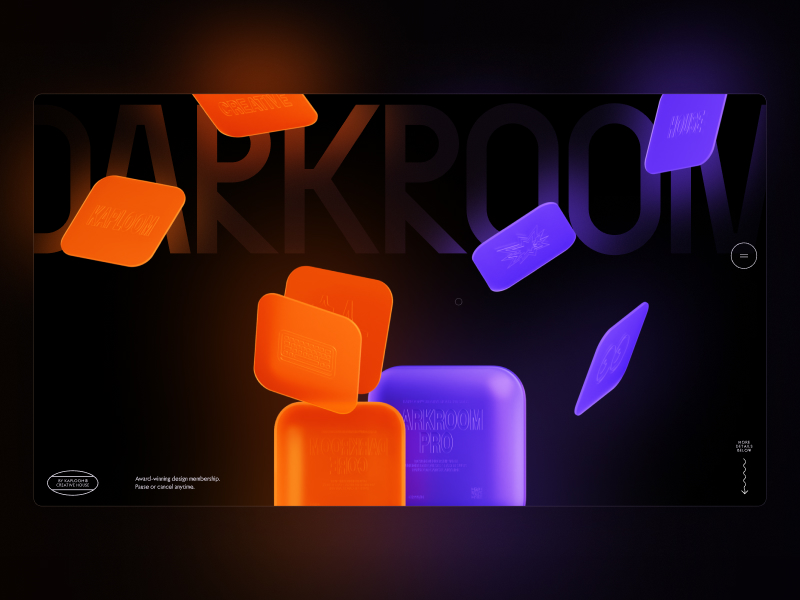

# Glowing Text Marquee Animation

Discover the process of creating a glowing SVG text animation with a marquee effect using only HTML and CSS.

[Article on Codrops](https://tympanus.net/codrops/?p=78669)

[Demo](http://tympanus.net/Tutorials/GlowingTextMarqueeAnimation/)

## Installation

Run this demo on a [local server](https://developer.mozilla.org/en-US/docs/Learn/Common_questions/Tools_and_setup/set_up_a_local_testing_server).

## Misc

Follow Kaploom®Creative House: [Instagram](https://www.instagram.com/kaploomdesign/)

Follow Codrops: [X](http://www.X.com/codrops), [Facebook](http://www.facebook.com/codrops), [GitHub](https://github.com/codrops), [Instagram](https://www.instagram.com/codropsss/)

## License
[MIT](LICENSE)

Made with :blue_heart:  by [Codrops](http://www.codrops.com) and [Kaploom®Creative House](https://www.instagram.com/kaploomdesign/)

